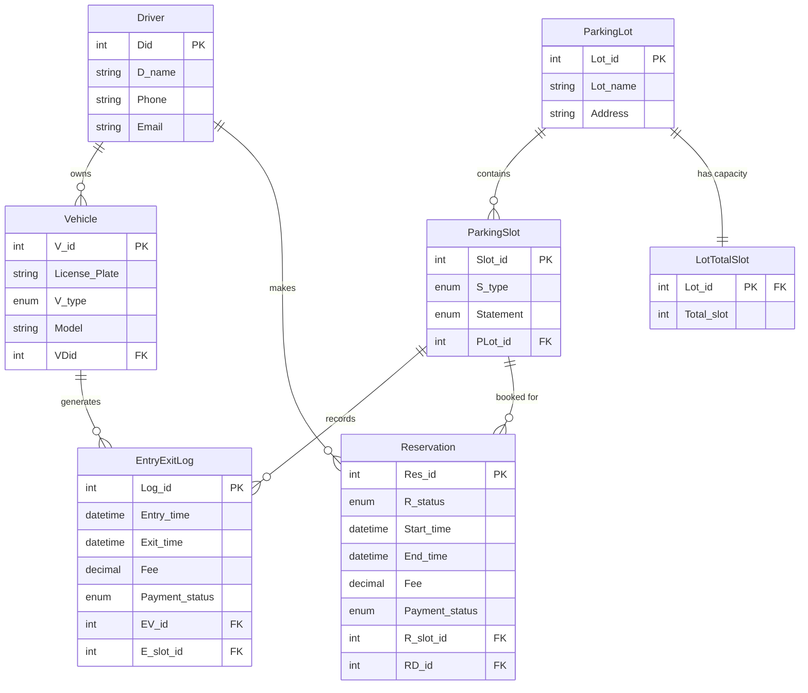

# SmartPark - Database Documentation

This document provides a comprehensive overview of the `smart_parking` relational database. It includes the Entity-Relationship (ER) model,a breakdown of real-world usage flows, and the critical SQL queries utilized in the backend.

---

## 1. Application Usage Flow

The database serves as the backbone for the SmartPark application, facilitating the complete lifecycle of a parking system:
1. **User Onboarding:** A user registers, creating a row in the `Driver` table. 
2. **Vehicle Registration:** The driver registers one or multiple cars/bikes. These are stored in the `Vehicle` table and linked to the driver via the `VDid` foreign key.
3. **Infrastructure Setup:** Administrators create physical locations (`ParkingLot`) and define their explicit capacity (`LotTotalSlot`). They then map individual parking spaces (`ParkingSlot`) to these lots.
4. **Reservation Phase:** Drivers browse available slots and make advance bookings. The system inserts a row into `Reservation`, locking the slot for that time and applying pessimistic concurrency control to prevent double-booking.
5. **Live Check-In / Check-Out:** When a driver physically arrives and parks, an `EntryExitLog` is generated. When they leave, the exit timestamp is stamped, fees are auto-calculated based on vehicle type and duration, and the slot is freed for the next user.

---


## 2. Entity-Relationship (ER) Model

The database is built using a normalized relational structure. Below is the Mermaid ER diagram representing the entities, their attributes, and their relationships.



### Table Breakdown

1. **Driver**: Stores the core user profile for customers accessing the app. Includes unique Phone and Email constraints.
2. **Vehicle**: Links physical vehicles to a specific `Driver` using a Foreign Key (`VDid`). Tracks the license plate and vehicle type (Two-Wheeler, Four-Wheeler, Heavy).
3. **ParkingLot**: Defines the physical locations managed by the system.
4. **LotTotalSlot**: Acts as an extension (or 1-to-1 weak entity) of `ParkingLot` to explicitly track the stated capacity of the lot independently of dynamically added slots.
5. **ParkingSlot**: The individual spaces within a `ParkingLot`. Tracks its explicit type and its current live `Statement` (Status: Available, Occupied, Reserved).
6. **Reservation**: Links a `Driver` to a specific `ParkingSlot` for a predefined time range.
7. **EntryExitLog**: Records live, real-time parking events. Links a physical `Vehicle` to a physical `ParkingSlot`, capturing Entry and Exit timestamps for automated fee generation.

---

## 3. Key SQL Queries Explained

The Node.js backend uses raw SQL queries (via the `mysql2` package) to communicate with the database. Here are the most complex and critical queries explained.

### A. Dashboard Analytics & Aggregation
To display real-time statistics to administrators, we use complex `JOIN` and aggregation functions.

**1. Live Lot Occupancy:**
Calculates exactly how many slots are currently unavailable across different parking lots.
```sql
SELECT pl.Lot_name, lts.Total_slot,
  SUM(ps.Statement != 'Available') AS occupied
FROM ParkingLot pl
JOIN LotTotalSlot lts ON lts.Lot_id = pl.Lot_id
JOIN ParkingSlot  ps  ON ps.PLot_id = pl.Lot_id
GROUP BY pl.Lot_id;
```
*Explanation:* Joins the `ParkingLot`, its total capacity (`LotTotalSlot`), and its specific slots (`ParkingSlot`). The `SUM` with a conditional expression natively counts how many slots are occupied/reserved.

**2. Total Revenue Calculation:**
```sql
SELECT COALESCE(SUM(Fee),0) AS total FROM Reservation WHERE Payment_status='Paid';
SELECT COALESCE(SUM(Fee),0) AS total FROM EntryExitLog WHERE Payment_status='Paid';
```
*Explanation:* Aggregates the `Fee` column from both the reservations table and live entry/exit logs. `COALESCE` ensures that if no paid records exist, the query safely returns `0` instead of `NULL`.

### B. Transactions & Concurrency Control (Reservations)
When multiple users try to book the same slot at the same time, we utilize SQL Transactions and explicit Row Locking.

**1. Pessimistic Row Locking:**
```sql
SELECT * FROM ParkingSlot WHERE Slot_id=? FOR UPDATE;
```
*Explanation:* The `FOR UPDATE` clause places an exclusive lock on the specific slot row. If two transactions try to book it simultaneously, the second one is forced to wait until the first completes.

**2. Time-Range Conflict Detection:**
```sql
SELECT Res_id FROM Reservation
WHERE R_slot_id=? AND R_status IN ('Pending','Confirmed')
  AND NOT (End_time <= ? OR Start_time >= ?);
```
*Explanation:* Checks if a slot is already booked during the requested time. The overlapping logic `NOT (End_time <= requested_start OR Start_time >= requested_end)` efficiently flags any mathematical time overlap.

### C. Live Entry/Exit Processing
When a user checks in or checks out of a space.

**1. Logging an Entry:**
```sql
INSERT INTO EntryExitLog (Entry_time, EV_id, E_slot_id) VALUES (?,?,?);
UPDATE ParkingSlot SET Statement='Occupied' WHERE Slot_id=?;
```
*Explanation:* Wrapped in a database transaction, this inserts the live check-in time and instantly flips the physical slot status to `Occupied` so no one else can reserve it.

**2. Logging an Exit & Applying Fees:**
```sql
UPDATE EntryExitLog SET Exit_time=?, Fee=?, Payment_status=? WHERE Log_id=?;
UPDATE ParkingSlot SET Statement='Available' WHERE Slot_id=?;
```
*Explanation:* Records the exit timestamp, stores the auto-calculated fee, and flips the parking slot back to `Available` for the next driver.

### D. Multi-Table Fetching
**1. Fetching Detailed Logs:**
```sql
SELECT l.*, v.License_Plate, v.V_type, v.Model,
       d.D_name, ps.Slot_id AS slot_num, pl.Lot_name
FROM EntryExitLog l
JOIN Vehicle     v  ON v.V_id     = l.EV_id
JOIN Driver      d  ON d.Did      = v.VDid
JOIN ParkingSlot ps ON ps.Slot_id = l.E_slot_id
JOIN ParkingLot  pl ON pl.Lot_id  = ps.PLot_id
ORDER BY l.Log_id DESC;
```
*Explanation:* Used in the Admin dashboard to display complete log history. It joins 5 different tables to assemble a complete readable record: The log details, the specific vehicle, the vehicle's owner, the physical slot, and the name of the parking lot where the slot resides.
